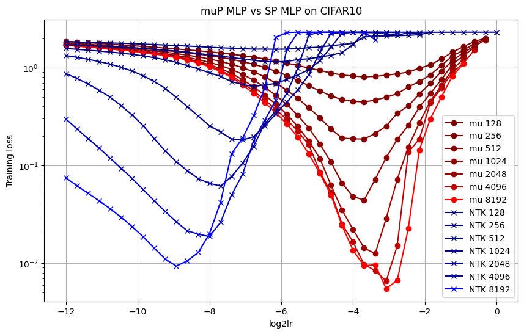

# mup

A minimal (really) implementation of muP with SGD following the Tensor Programs IV and Tensor Programs V papers. Classes `NTKMLP` and `muMLPTab9` implement SP and muP parametrizations as showed in Table1 TPIV paper or Table9 TPV paper equivalently. 

This implementation does not base on "setting shapes", nor optimizer trickes, like others. There is also no tunable scaling hyperparameters.

Running `run_mlp.sh` allows reproducing the results from below. Training script will auto-run on all GPUs with >16GB memory and <50% utilization. Feel free to change it as per your GPUs.

Special thanks to dvruette for help deciphering the notation and discussions on debugging. 
